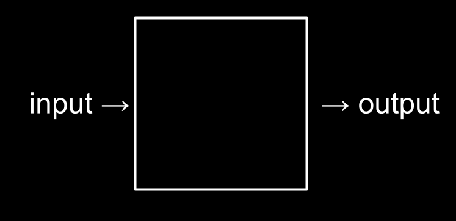
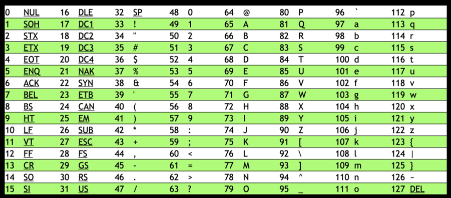

## Computer Science

Essentially, computer programming is about **taking some input and creating some output** - thus solving a problem. What happens in between the input and output, what we could call a *black box*, is the focus of this course.



Computers generally use **eight bits** (also known as a *byte*) to represent a number. 

For example, 00000101 is the number 5 in binary. 11111111 represents the number 255.

```
2^7 2^6 2^5 2^4 2^3 2^2 2^1 2^0
0   0   0   0   0   1   0   1
= 1 * 2^2 + 1 * 2^0
= 4 + 1
= 5

2^7 2^6 2^5 2^4 2^3 2^2 2^1 2^0
1   1   1   1   1   1   1   1
= 1 * 2^7 + ... + 1 * 2^0
= 2^8 - 1 
= 255
```

## ASCII

*ASCII* (/ˈæski：), an acronym for **American Standard Code for Information Interchange**, is a character encoding standard for electronic communication. Since there is an **overlap** between the ones and zeros that represent numbers and letters, the ASCII standard was created to **map specific letters to specific numbers**.



```
H   I   !
72  73  33
```

## Unicode

Since there were not enough digits in binary to represent all the various characters that could be represented by humans, the *Unicode standard* expanded the number of bits that can be transmitted and understood by computers. Unicode includes not only special characters, but emoji as well.

## Representation

Further, zeros and ones can be used to represent images, videos, and music!

- Images are simply collections of RGB values.
- Videos are sequences of many images that are stored together, just like a flipbook.
- Music can be represented through MIDI data.

e