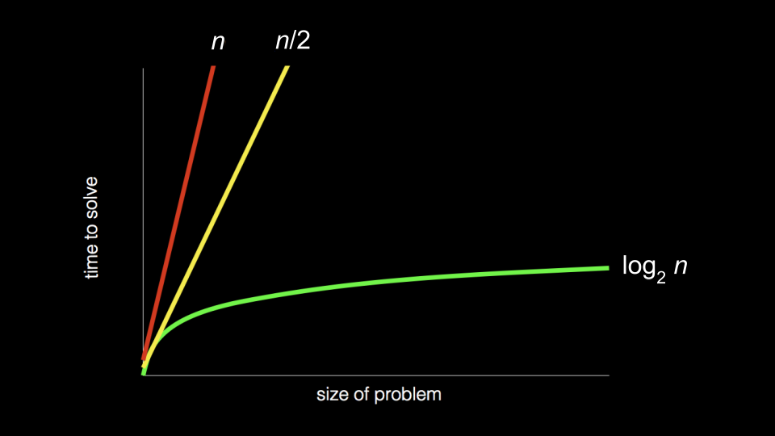

## Computer Science

Essentially, computer programming is about **taking some input and creating some output** - thus solving a problem. What happens in between the input and output, what we could call a *black box*, is the focus of this course.


Computers generally use **eight bits** (also known as a *byte*) to represent a number. 

For example, 00000101 is the number 5 in binary. 11111111 represents the number 255.

```
2^7 2^6 2^5 2^4 2^3 2^2 2^1 2^0
0   0   0   0   0   1   0   1
= 1 * 2^2 + 1 * 2^0
= 4 + 1
= 5

2^7 2^6 2^5 2^4 2^3 2^2 2^1 2^0
1   1   1   1   1   1   1   1
= 1 * 2^7 + ... + 1 * 2^0
= 2^8 - 1 
= 255
```

## ASCII

*ASCII* (/ˈæski：), an acronym for **American Standard Code for Information Interchange**, is a character encoding standard for electronic communication. Since there is an **overlap** between the ones and zeros that represent numbers and letters, the ASCII standard was created to **map specific letters to specific numbers**.


```
H   I   !
72  73  33
```

## Unicode

Since there were not enough digits in binary to represent all the various characters that could be represented by humans, the *Unicode standard* expanded the number of bits that can be transmitted and understood by computers. Unicode includes not only special characters, but emoji as well.

## Representation

Further, zeros and ones can be used to represent images, videos, and music!

- **Images** are simply collections of RGB values.
- **Videos** are sequences of many images that are stored together, just like a flipbook.
- **Music** can be represented through MIDI data.

## Algorithms

**Big-O notation:**



Notice that the first algorithm, highlighted in red, has a big-O of `n` because if there are 100 names in the phone book, it could take up to 100 tries to find the correct name. The second algorithm, where two pages were searched at a time, has a big-O of `n/2` because we searched twice as fast through the pages. The final algorithm has a big-O of $log_{2}{n}$ as doubling the problem would only result in one more step to solve the problem.

## Pseudocode (伪代码)

The ability to **create pseudocode** is central to one’s success in both this class and in computer programming.

Pseudocode is a **human-readable version of your code**. For example, considering the third algorithm above, we could compose pseudocode as follows:

```
1  Pick up phone book
2  Open to middle of phone book
3  Look at page
4  If person is on page
5      Call person
6  Else if person is earlier in book
7      Open to middle of left half of book
8      Go back to line 3
9  Else if person is later in book
10     Open to middle of right half of book
11     Go back to line 3
12 Else
13     Quit
```

Pseudocoding is such an important skill for at least two reasons: 
- First, when you pseudocode before you create formal code, it allows you to think through the logic of your problem in advance.
- Second, when you pseudocode, you can later provide this information to others that are seeking to understand your coding decisions and how your code works.

Notice that the language within our pseudocode has some unique features:
- First, some of these lines begin with verbs like pick up, open, look at. Later, we will call these *functions*.
- Second, notice that some lines include statements like `if` or `else if`. These are called *conditionals*.
- Third, notice how there are expressions that can be stated as `true` or `false`, such as “person is earlier in the book.” We call these *boolean expressions*.
- Finally, notice how these statements like “go back to line 3.” We call these *loops*.
- These building blocks are the fundamentals of programming.

## Artificial Intelligence

*large language models (LLM)* look at patterns in large blocks of language. Such language models attempt to create a best guess of what words come after one another or alongside one another.

