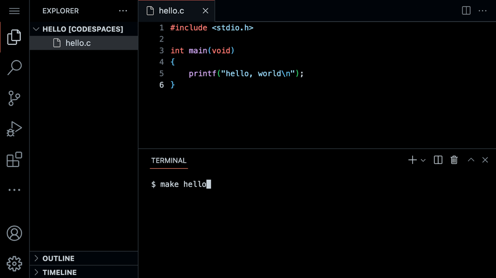
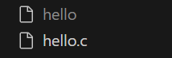

# lecture 1: C

- Source code: A list of instructions for the computer that is human readable e.g. `C codes`, `Python codes`
- Machine code: A pattern of ones and zeros only understood by machines
- Complier: A very special software that converts *source code* into *machine code*
- Three axes to evaluate code: correctness, design and style
  - Correctness: Does the code run as intended?
  - Design: How well is the code designed?
  - Style: How aesthetically pleasing and consistent is the code?

## Hello World

### Visual Studio Code

- A **file explorer (文件浏览器)** on the left side 
- A **text editor** in the middle where you can edit your program
- A **command line interface**, known as a **CLI**, command line, or terminal window where send commands to the computer in the cloud.



### Three VS code commands

```
$ code hello.c
$ make hello
$ ./hello
```

- `code hello.c`: Creates a file and allows us to type instructions for this program
- `make hello`: Complies the file from instructions in C and creates a executable file called `hello` (Machine codes)
- `./hello`: Runs the program called `hello`

### Hello World!

```C
#include <stdio.h>

int main(void)
{
    printf("hello, world\n");
}
```

Now, open the *file explorer* on the left. You will notice that there is now both a file called `hello.c` and another file called `hello`. `hello.c` is able to be read by the compiler: It’s where your code is stored. `hello` is an executable file that you can run, but cannot be read by the compiler.



## Functions

### `printf`

Statement: `printf("Hello, world\n");` is closed with `;`. The argument passed to `printf` is `Hello, world\n`
- `\`: An **escape character (转义字符)** that tells the complier that `\n` is a special instruction.
- `printf`: Means "print formatly"
- `;`: A statement ends

### `# include <stdio.h>`

`# include <stdio.h>` tells the compile that you want to use the capabilities of a library called `stdio.h`

> Read about all the capabilities of this library on the [Manual Pages](https://manual.cs50.io/)

CS50 has its own library called `cs50.h`

## Variables

